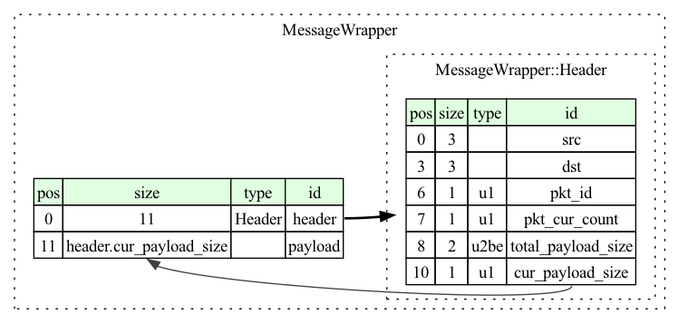
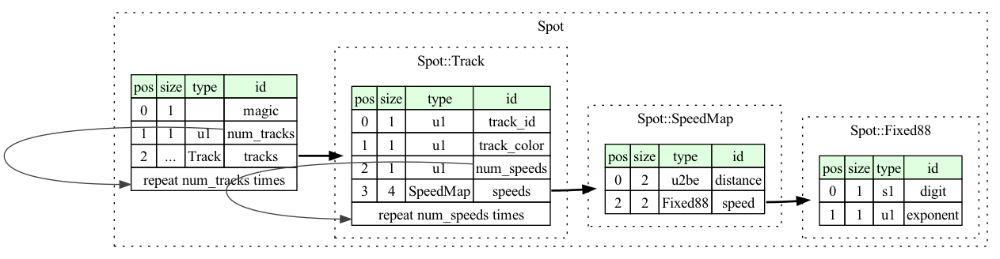
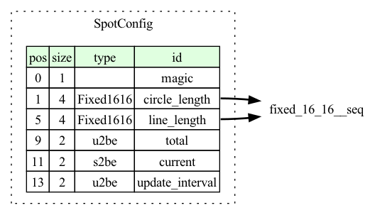
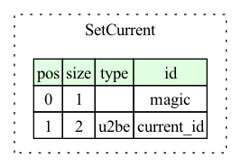
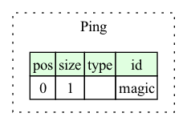

# Custom protocol

## Why not [protobuf](https://protobuf.dev)?

[nanopb](https://github.com/nanopb/nanopb) while quite lightweight, is still too
heavy for 16KB of ROM, who eats almost 4KB of ROM with encoding and decoding.
Besides fixed point numbers and shorts (`uint16_t`) are not supported natively.

## Protocols

I'm using [kaitai](https://kaitai.io/) to describe the protocol
and handwrite the encoder and decoder in C++.

### [MessageWrapper](message_wrapper.ksy)

Every other protocol is wrapped in a message wrapper.
You could think it's equivalent to the OSI layer 2.



Don't do CRC since the RF chip already does it.

Refer to: [In-Depth: LoRaWAN® End Device Activation](https://lora-developers.semtech.com/documentation/tech-papers-and-guides/lorawan-device-activation/device-activation/)

### [Spot](spot.ksy)

magic: `0x76`



### [SpotConfig](spot_config.ksy)

magic: `0x80`



### [SetCurrent](set_current.ksy)

magic: `0x86`



### [Ping](ping.ksy)

magic `0x06`



Only a magic nothing else.


## Compile the protocol

```bash
# graphviz or html
# don't try to generate languages code since fixed point numbers should be parsed manually
kaitai-struct-compiler -t graphviz spot.ksy
dot -Tpng spot.dot > figures/spot.png
kaitai-struct-compiler -t graphviz message_wrapper.ksy
dot -Tpng message_wrapper.dot > figures/message_wrapper.png
kaitai-struct-compiler -t graphviz spot_config.ksy
dot -Tpng spot_config.dot > figures/spot_config.png
kaitai-struct-compiler -t graphviz set_current.ksy
dot -Tpng set_current.dot > figures/set_current.png
kaitai-struct-compiler -t graphviz ping.ksy
dot -Tpng ping.dot > figures/ping.png
kaitai-struct-compiler -t graphviz boring.ksy
dot -Tpng boring.dot > figures/boring.png
kaitai-struct-compiler -t graphviz proto/simple_wrapper.ksy
dot -Tpng simple_wrapper.dot > figures/simple_wrapper.png
```
